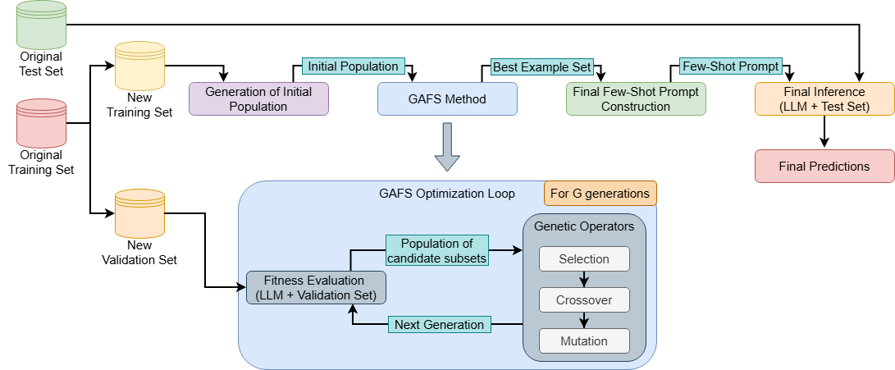

# GAFS

## GAFS: A Genetic Algorithm-Based Few-Shot Example Selection for Large Language Models
**DOI will be added upon paper acceptance.**

Few-Shot Learning (FSL) in Large Language Models (LLMs) is highly sensitive to the selection of in-context examples. While most existing approaches rely on random sampling or retrieval-based heuristics, these methods evaluate examples independently and fail to capture interactions between them.

This repository introduces **GAFS (Genetic Algorithm for Few-Shot Selection)**, a novel method that formulates example selection as a **global combinatorial optimization problem**. Instead of selecting examples individually, GAFS searches for subsets of examples that jointly maximize downstream performance.

The method is evaluated on multiple Spanish hate speech detection datasets and consistently outperforms standard baselines such as Zero-Shot Learning (ZSL), random and retrieval-based selection FSL.


### Highlights
- First use of genetic algorithms for FSL example selection

- GAFS outperforms random and retrieval-based FSL baselines

- Consistent gains across LLMs and Spanish hate speech datasets

- Captures complex interactions missed by heuristic selection methods

- Establishes FSL selection as a global optimization problem

### Authors

- **Tomás Bernal-Beltrán** — University of Murcia  
  [Google Scholar](https://scholar.google.com/citations?user=0bTUxQEAAAAJ) · [ORCID](https://orcid.org/0009-0006-6971-1435)

- **Ronghao Pan** — University of Murcia  
  [Google Scholar](https://scholar.google.com/citations?user=80lntLMAAAAJ) · [ORCID](https://orcid.org/0009-0008-7317-7145)

- **José Antonio García-Díaz** — University of Murcia  
  [Google Scholar](https://scholar.google.com/citations?user=ek7NIYUAAAAJ) · [ORCID](https://orcid.org/0000-0002-3651-2660)

- **Rafael Valencia-García** — University of Murcia  
  [Google Scholar](https://scholar.google.com/citations?user=GLpBPNMAAAAJ) · [ORCID](https://orcid.org/0000-0003-2457-1791)  

> **Affiliations:**  
> \* *Departamento de Informática y Sistemas, Universidad de Murcia, Campus de Espinardo, 30100, Murcia, Spain*

### Publication
**Publication information will be added upon paper acceptance.**

### Acknowledgments
This work is part of the research project LaTe4PoliticES (PID2022-138099OB-I00) funded by MICIU/AEI/10.13039/501100011033 and the European Regional Development Fund (ERDF EU/FEDER UE)-a way of making Europe. Mr. Tomás Bernal-Beltrán is supported by University of Murcia through the predoctoral programme.

### Citation
**Citation information will be added upon paper acceptance.**

### Abstract
Few-shot learning (FSL) in large language models relies heavily on the selection of in-context examples, yet most existing approaches use simple heuristics such as random sampling or similarity-based retrieval. In this work, we propose GAFS, a genetic algorithm-based method that formulates example selection as a global combinatorial optimization problem. Unlike standard strategies, GAFS searches for subsets of examples that jointly maximize downstream task performance, explicitly capturing interactions between examples.
We evaluate the proposed approach on four Spanish hate speech detection datasets (HatEval, EXIST, DETESTS and HOMO-MEX) using a diverse set of LLM architectures and parameter scales. The results show that GAFS consistently outperforms random and retrieval-based FSL in the majority of models, achieving substantial improvements in macro-averaged F1-score across datasets. Statistical significance analysis using McNemar's test further confirms that these gains are robust, with GAFS correctly classifying nearly two thousand more instances than the strongest baseline ($\Delta = 1970$, $p < 0.001$).
In addition, an analysis of the selected examples reveals that maximizing diversity or coverage alone is not sufficient for optimal performance. Instead, selecting examples that are well aligned with both the model and the task plays a more critical role. These findings highlight the importance of considering interactions between examples, rather than relying on local selection criteria.
Overall, this work demonstrates that treating example selection as a global optimization problem is a highly effective strategy for improving FSL in in-context learning, enabling more principled, adaptive and performance-driven prompting methods.

## GAFS Method

GAFS formulates FSL example selection as a **combinatorial optimization problem**, where the goal is to identify a subset of training examples that maximizes downstream task performance when used in-context.

Formally:

```
    argmax_S f(S), subject to |S| = K
```

Where:
- `S` is a subset of training examples.
- `K` is the number of examples included in the prompt.
- `f(S)` is the downstream task performance (macro-F1).

The overall optimization process of GAFS is illustrated below:



The figure shows how GAFS iteratively evolves candidate subsets of examples using a genetic algorithm guided by LLM-based evaluation, ultimately producing an optimized few-shot prompt.

### Key components

#### Representation
Each candidate solution is encoded as a **binary vector** of size `N` (training set size), where:
- `1` → example is selected.
- `0` → example is not selected.

A constraint enforces that exactly `K` examples are selected.

#### Fitness Function
Each subset `S` is evaluated by:
1. Constructing a FSL prompt using the selected examples.
2. Running the LLM on a validation set.
3. Computing **macro-F1 score**.

This allows GAFS to directly optimize **task performance**, instead of proxy metrics such as similarity or diversity.

#### Genetic Operators

GAFS evolves a population of candidate subsets using:

- **Selection (Tournament Selection)**  
  Selects the best individuals among random pairs, balancing exploitation and exploration.

- **Crossover (Uniform Crossover)**  
  Combines two subsets by randomly mixing their selected examples.

- **Mutation (Swap Mutation)**  
  Replaces one selected example with a non-selected one (preserving the subset size `K`).


#### Optimization Process

- Initialize a population of random subsets.
- Iteratively evolve the population over `G` generations.
- Evaluate each subset using LLM-based fitness.
- Select the best-performing subset as final solution.

Unlike retrieval-based methods, GAFS **does not optimize individual examples**, but the **subset as a whole**.

## Why GAFS Works

Unlike standard approaches:

| Method | Selection Strategy | Limitation |
|------|------------------|-----------|
| Random FSL | Random sampling | High variance, unstable |
| Retrieval-based FSL | Similarity / diversity | Ignores interactions |
| **GAFS** | **Global optimization** | — |

GAFS **does not evaluate examples independently**, but searches for subsets that:

- Capture **complementary information**.
- Align with the **model’s behavior**.
- Optimize **joint contribution to performance**.

### Key Insight

> The best set of examples is not the sum of the best individual examples.

GAFS explicitly models **interactions between examples**, enabling the discovery of subsets that:
- Are not necessarily the most similar or diverse.
- But are **optimal for the model and the task**.

### Computational Considerations

- Fitness evaluation requires **LLM inference**
- Cost depends on:
  - Population size (`P`).
  - Number of generations (`G`).
  - Validation set size.

To mitigate this:
- Validation subset is used instead of full training set.
- Fitness values can be cached to avoid recomputation.

## Experimental Setup

We evaluate GAFS under a controlled experimental framework designed to isolate the impact of **example selection strategies** on In-Context Learning (ICL) performance.

All methods are compared using the **same prompt templates, decoding configuration and evaluation metrics**, ensuring that performance differences are solely attributable to the selection strategy.

### Task

The evaluation focuses on **Spanish hate speech detection**, a challenging classification task characterized by:

- Implicit and context-dependent language.
- Domain variability across datasets.
- Sensitivity to prompt design and example selection.

### Datasets
We evaluate GAFS on four benchmark datasets covering different forms of harmful content:

- **HatEval** — hate speech targeting immigrants and women.
- **EXIST** — sexism detection in social media.  
- **DETESTS** — racial stereotypes in news comments.
- **HOMO-MEX** — LGBT+phobic content in Mexican Spanish.

These datasets vary in:
- Domain (Twitter, news, social media, lyrics).
- Label space (binary vs multi-class).
- Linguistic phenomena (explicit vs implicit hate).

This diversity enables a **robust and cross-domain evaluation**.

> These datasets are **not distributed with this repository**.  
Users are responsible for obtaining access through the official sources and complying with their respective licenses and usage terms.

### Models
We evaluate a diverse set of **open-weight decoder-only LLMs**, covering different architectures and parameter scales:

- **Gemma** — 2B, 9B.
- **LLaMA** — 1B, 3B, 8B.  
- **Qwen** — 1.5B, 3B, 7B. 
- **Mistral** — 7B.
- **Phi-3.5 Mini**.

This selection allows us to analyze:
- The effect of **model size**.
- Differences across **architectural families**.
- Model-dependent behavior in ICL.

### Baselines
We compare GAFS against three representative ICL strategies:

- **Zero-Shot Learning**  
  - No examples provided.  
  - Serves as a lower-bound baseline.  

- **Random Few-Shot Learning**  
  - Random selection of `K` examples.  
  - Simple but high variance.  

- **Retrieval-based Few-Shot Learning**  
  - Selection based on:
    - Semantic similarity.
    - Diversity (clustering).
    - Uncertainty (entropy).
  - Strong state-of-the-art baseline.

### Prompting & Inference

- Prompts are written in **English** (control language).
- Inputs remain in **Spanish**.
- Same prompt structure across all methods.
- Deterministic decoding:
  - `do_sample = False`.
  - `num_beams = 1`.
- Fixed number of examples:
  - `K = 10` for all FSL methods.

This ensures **fair and reproducible comparisons**.

### Evaluation Metrics

Performance is measured using:

- **Macro-F1 (primary metric)**.
- Macro Precision.
- Macro Recall.

Macro-averaging ensures balanced evaluation across classes, especially under class imbalance.

## Results Summary

GAFS consistently outperforms standard FSL selection strategies across datasets and model families.

### Main Findings

- GAFS achieves the **best performance in the majority of evaluated models**.
- Improves over strong baselines by up to **+6 F1 points**.
- Delivers **consistent gains across all datasets**, including cross-domain settings.
- Produces **+1970 additional correct predictions** compared to the strongest baseline.
- All improvements are **statistically significant** (McNemar’s test, *p* < 0.05).

### Robustness Across Models

- Gains are observed across:
  - Different architectures (Gemma, LLaMA, Qwen, Mistral, Phi).
  - Different scales (1B → 9B parameters).
- GAFS shows **more stable performance** than retrieval-based methods, which are more model-dependent.

### When Does GAFS Help the Most?

GAFS provides the largest improvements when:

- The task is **complex or ambiguous** (e.g., implicit hate speech).
- The model is **sensitive to example selection**.
- Heuristic methods fail to capture **complementary information**.

### Key Insight

> The best set of examples is not the sum of the best individual examples.

Selecting examples based on similarity or diversity alone is **not sufficient**.  
GAFS shows that **interactions between examples** play a critical role in ICL performance.

### Interpretation

- Retrieval-based methods optimize **local properties** (similarity, diversity)
- GAFS optimizes **global performance**
- This allows GAFS to discover:
  - More informative combinations.
  - Better alignment with the model.
  - More effective decision boundaries.

## Reproducibility

This repository provides all the necessary components to fully reproduce the experiments reported in the paper, including:

- Prompt templates for **ZSL** and **FSL** settings.
- Implementation of the **GAFS optimization algorithm**.
- Scripts for all experimental configurations (ZSL, random and retrieval-based FSL).
- Files for efficient and scalable execution.

All experiments are designed to be reproducible under a controlled setup, with fixed seeds and deterministic decoding.

### Repository Structure

├── prompts/
│ └── Prompt templates used in the experiments
│
├── code/
│ ├── experiment_scripts/
│ │ ├── experiments_zs.sh
│ │ ├── experiments_fs.sh
│ │ └── experiments_ga.sh
│ │
│ ├── zero_shot.py
│ ├── few_shot.py
│ ├── gafs.py
│ ├── functions.py
│ └── ga_functions.py
│
├── images/
│ └── Images included in this repository
│
└── README.md

### Code Description

- `zero_shot.py`  
  Script for running ZSL experiments.
    
    **Arguments:**
  - `-m` (int) → Model to evaluate  
  - `-d` (str) → Path to the dataset

- `few_shot.py`  
  Script for running Few-Shot experiments with different example selection strategies.

  **Arguments:**
  - `-m` (int) → Model to evaluate  
  - `-d` (str) → Path to the dataset  
  - `-e` (int) → Number of examples used in the prompt (default: 5)  
  - `-t` (int) → Strategy to select examples (default: 0)  
    - `0` → Random selection  
    - `1` → Retrieval-based selection

- `gafs.py`  
  Main script for running the GAFS optimization process for few-shot example selection.

  **Arguments:**
  - `-m` (int) → Model to evaluate  
  - `-d` (str) → Path to the dataset  
  - `-t` (int) → Strategy to evaluate each candidate solution (default: 0)  
    - `0` → Subset-based evaluation  
    - `1` → Full dataset evaluation  

  **Genetic Algorithm Parameters:**
  
  The parameters of the genetic algorithm are defined directly within the script:

  - `POP_SIZE` → Population size (default: 10)  
  - `N_GEN` → Number of generations (default: 5)  
  - `MUT_RATE` → Mutation rate (default: 0.1)  
  - `CROSS_RATE` → Crossover rate (default: 0.8)  

  **Additional Parameters:**

  - `K` → Number of examples selected for the few-shot prompt (default: 10)  
  - `VALIDATION_PERCENTAGE` → Proportion of data used for fitness evaluation (default: 0.1)

- `functions.py`  
  Utility functions used across the experimental pipeline.

- `ga_functions.py`  
  Functions related to the genetic algorithm operations used in GAFS.

### Experiment Scripts

The following scripts provide a simple way to reproduce the experiments:

- `experiments_zs.sh`  
  Executes ZSL experiments.

- `experiments_fs.sh`  
  Executes FSL experiments with baseline methods.

- `experiments_ga.sh`  
  Executes experiments using the GAFS optimization process.

These scripts contain the commands and configurations required to run the experiments end-to-end.

## License

This repository is released under the MIT License.

The code is provided for research and academic purposes, and can be freely used, modified and distributed under the terms of the license.

Any datasets used in the experiments remain subject to their respective licenses and terms of use.